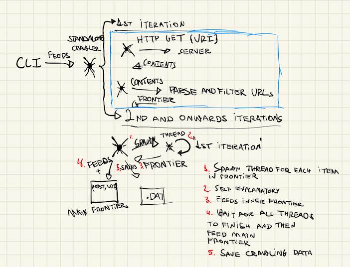

# Spawner
This is a web crawler made entirely in Rust. The main objective is to rewrite
the shitty code that I made as `dist-crawler`, of which is a distributed crawler
communicating through RPC protocol. The latter was made in Go, so I first thought
that the new version could've been made in this language as well. However, I do
work full time with Go, and I do want to exercise my skills in other tools that I
like, so Rust is the way to go.

## High-level


The high-level description of the inner workings of the crawler are the following:

1. A CLI program parses the user's input to coordinate the crawler's actions. It
may either do the following:
  - Create the Web component to hold the minions;
  - Create a single minion instance and connect it to the Web;
  - Trigger the crawling command through the crawler program according to the configurations set.
2. The crawler program will coordinate the events between the user and the application.
 It feeds and retrieves items from the `Frontier`, a component that holds `domain:port, URI` data
 for the whole crawler environment, which coordinates which URLs it should crawl next. Initially,
 it crawls from the starting URL provided by the user, and it gets fed with crawling iterations.
3. It then connects to a component called `Web`, which is a pool of instances that will do
the heavy lifting. It should be called by the `Crawler` with a set of `Frontier`'s data to
actually make requests from. The `Web` coordinates which instance will do a certain
crawling action through a load balancing algorithm.
4. The way that the `Web` interacts with the `Frontier` is that it must only append
new data, but it can never retrieve new items to crawl, because the `Crawler` will
determine if it has ever seen that following domain:port and URI combination, thus
optimizing when getting data from the web page with repetitive `Frontier` data.
5. The nodes will make HTTP requests based on the list that the `Web` gets from the
`Crawler`. It may fetch multiple requests concurrently, if given enough data to do
so (more than 1 Frontier row), also being fault-tolerant, by keeping crawling errors
along with data that it has fetched from other servers.
6. Of course, nodes CANNOT make uncontrollable requests to servers on the internet, since
we want a crawler to obey certain restrictions. The requests are coordinated
along with another component called `Counselor`, which will enforce some rules on
the node requester. The following rules may be configurated:
  - Retry policy;
  - Throttling;

However, there's one rule that it'll always enforce:
  - Obey the `robots.txt` directives.
It'll hold a collection of `robots.txt` directives for each domain/subdomain it'll
crawl, and will either allow or block requests to certain `Frontier` targets.
7. The `ResultsDB` will store the crawling data with their respective ranking.
8. It must be able to identify interruptions, and need to be able to recover from
those interruptions accordingly. So a `State Saver` is a component that will either
detect interruptions and save the state, and reload the state if needed.

It's a pretty daunting project, but rest assured: the most complicated part, which is
requesting data from webservers, is already implemented. The crawler can work on
standalone mode, and is concurrent + fault-tolerant, however, the `Counselor` hasn't been
created just yet, so it doesn't follow any rules. Also, we don't have the `ResultsDB`
just yet. So there's a lot of work to be done.

## Requirements
Just `cargo`.

```bash
$ curl --proto '=https' --tlsv1.2 -sSf https://sh.rustup.rs | sh
```

## Usage

```
usage: spawner [OPTIONS] --mode MODE COMMAND

OPTIONS:

--start-url URL where spawner will crawl first
--publish   Address with port to expose the web instance to the network
--web-url   Address with port to connect to the web instance in the network

MODE:

standalone  Single node executor
distributed Multiple node executor, must have --publish or --web-url set depending of command

COMMAND:

start   Well, start crawling, right?
serve   Start a web instance, only available in distributed mode
connect Start a node instance, and connect to the web instance, only available in distributed mode
```
